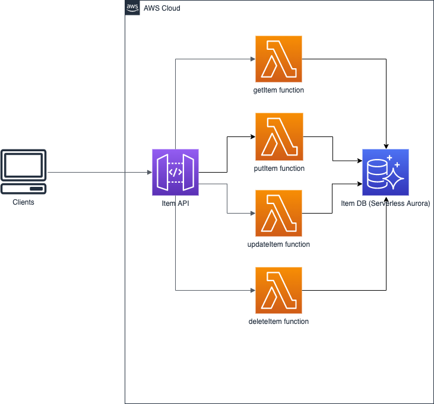

# aws-serverless-aurora-app

## About the application
It is an AWS SAM application that implements a CRUD API with Lambda handlers written in Java and uses Aurora Serverless as the database.

The architecture of the application is in the picture given below.



Please find the detailed description of this application in my Medium blog post: [Serverless CRUD API Java application: Aurora Serverless instead of DynamoDB](https://medium.com/@rostyslav.myronenko/serverless-crud-api-java-application-aurora-serverless-instead-of-dynamodb-a80f89abac03)

## Prerequisites
- Java 1.8+
- Apache Maven
- AWS CLI is installed and configured
- [AWS SAM CLI](https://docs.aws.amazon.com/serverless-application-model/latest/developerguide/serverless-sam-cli-install.html)

## Project structure

- [template.yaml](template.yaml) - The AWS SAM template, a descriptor of an AWS SAM application
- [aurora-serverless-lambda-layer](aurora-serverless-lambda-layer) - The Lambda Layer module that contains all the dependencies required for the Lambda functions.
- [aurora-serverless-core](aurora-serverless-core) - The Maven module that contains the common code of the Lambda functions. Is embedded into the layer as a Maven dependency.
- [aurora-serverless-get-item](aurora-serverless-get-item) - The Lambda function which implements the READ operation for the CRUD API.
- [aurora-serverless-put-item](aurora-serverless-put-item) - The Lambda function which implements the CREATE operation for the CRUD API.
- [aurora-serverless-update-item](aurora-serverless-update-item) - The Lambda function which implements the UPDATE operation for the CRUD API.
- [aurora-serverless-delete-item](aurora-serverless-delete-item) - The Lambda function which implements the DELETE operation for the CRUD API.
- [database.sql](database.sql) - The script to create a test table in the AWS RDS console via Query editor.
- [Serverless_Aurora.jmx](jmeter/Serverless_Aurora.jmx) - The JMeter test plan for load testing of the CRUD API.

## Build and deployment

To build and deploy with AWS SAM and Maven, please execute the sequence of the commands given below:
```
cd aurora-serverless-core
mvn install
cd ../aurora-serverless-lambda-layer
mvn install
cd ..
sam build
sam deploy --guided
```